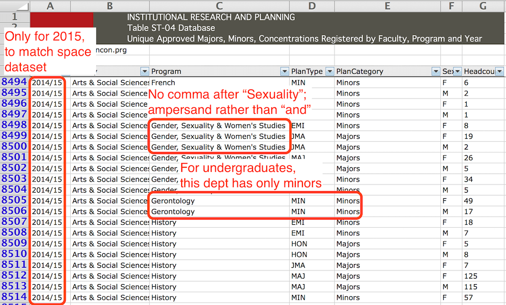

# How You Can Benefit From Data

---
<script src="dist/js/hand.js"></script>

## Intro to the workshop

More.

Who we are, where we're going

* DAY 1: PREPARATION, INCLUDING GETTING DATA

* DAY 2: ANALYSIS

Note:

* General use of HTML

  * Use Control&nbsp;+ (on Mac&nbsp;OS Command&nbsp;+) to increase the size of the font
  * Use Control&nbsp;0 (on Mac&nbsp;OS Command &nbsp;0) to reset the size to default
  * The images (with one exception) will adjust to fit screen width
  * The one exception is the wide diagram showing process---see notes
    next to that image for how to present it

* Ask for tent cards

* One of the first things you do is have participants write their
  preferred form of address (first name or title + last name ...)
  on their tent card

---

## Links to Tableau workbooks used in live demos

[Workbook with space and enrolment for academic departments](assets/Departmental space and enrolments.twbx)

[Workbook with space for all organizational units (not just academic)](assets/Space.twbx)

---

### What you need to know

* No prior computing or statistical knowledge assumed
* A knowledge of your own domain
* One or more problems within your domain

---

### What you will get out of this

1. Introduce you to the field of Big Data
2. A process for applying quantitative methods
3. See the process applied to exploring space and enrolment data at
  SFU

---

### Example of Optimizing Analytics: Google data centre cooling

Machine learning [reduced cooling power consumed by Google data centres](https://deepmind.com/blog/deepmind-ai-reduces-google-data-centre-cooling-bill-40/)

* Google data centers were already efficient
* Using machine learning techniques, cooling power was reduced 40% further
* Machine learning provided a general algorithm for optimizing cooling costs based on the unique details of each data centre

Note:

**Exercise:** List several problems in your professional life that might potentially
be improved through application of a data-focused analysis. Good targets include:

* Improvements that might have big payoff on important outcomes
* Terms that your field regards as essential ("student engagement",
  "critical thinking", "justice", ...)
  but that are vague, multi-valued, or subject to wide interpretation
* Important outcomes that you aren't sure how to measure

### About 1 hr 15 min to here.

---

### Example: Undergraduate headcount spreadsheet (IRP)



Note:

## TEASER FOR DAY 2

**TABLEAU LIVE**

Show tree maps of space and UG enrolment by faculty and department

* take time to describe how a tree map works
* highlight that each faculty is the same colour
* select on department within a faculty and show its location on both
  tree maps. Highlight that area on one display means TOTAL SPACE,
  while area on the other display means TOTAL UG ENROLMENT

Note that **Education UG enrolment is undercounted** (due to BEd students majoring
in other Faculties)

---?image=assets/img/UG-headcount-cropped.png

### Some text, yo!

---

```python
import csv

def do_csv(name):
  with open(name, 'r') as inp:
    rdr = csv.reader(inp)
    next(rdr) # Skip header
	for rec, num in rdr:
	  do_something(rec, num)
```

@[1](Make CSV library available)
@[4-6](Open CSV and read header)
@[7-8](Call do_something on every data line)
